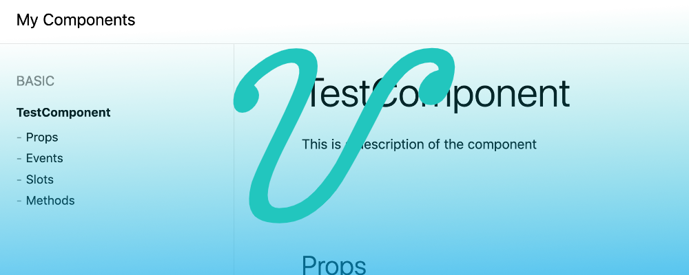
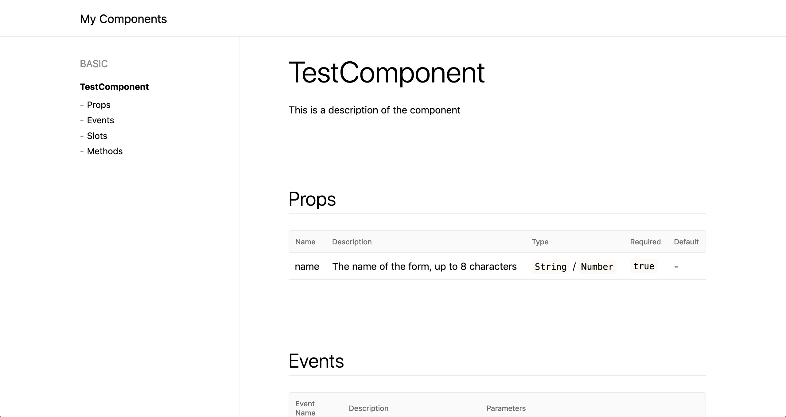

# Quick & easy documentation generation for Vue Components with vuese - Demo

This repo is a short demo of the tool [vuese](https://github.com/vuese/vuese) to create component documentation for Vue.js components.

> The accompanying blog post can be found on [dev.to](https://dev.to/berniwittmann/quick--easy-documentation-generation-for-vuejs-components-7k6)

**Result**



## Setup

Install the dependencies

```
npm install
```

## Generate docs

Generate the docs by running 

```
npm run docs
```
